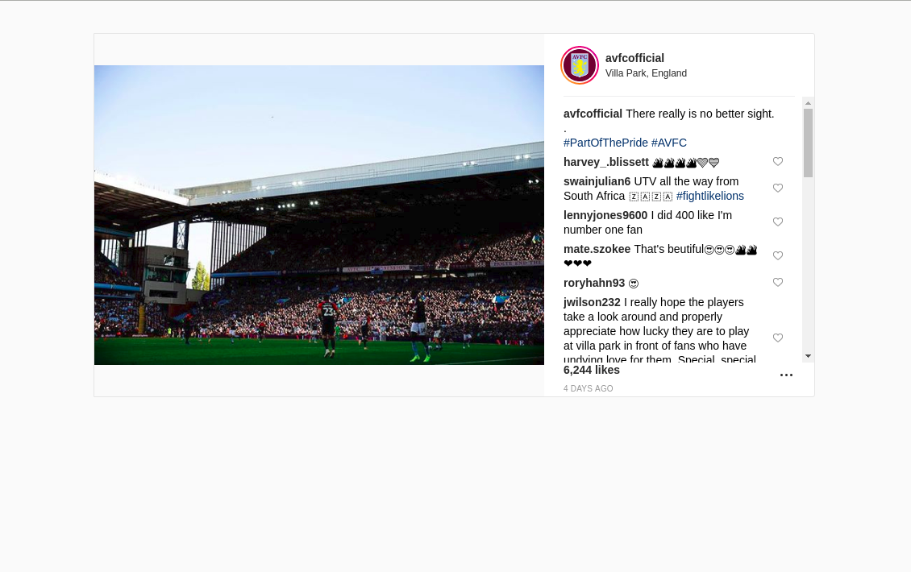

If I was to improve on the task I would seperate the hashtags and assign them a URL string related to the hashtag so you could link to a page containing the list of hashtags such as /{hashtag}

I would also filter the array for comments via the comments array rather than edge_media_to_comment. Although edge_media_to_comment was easier for me it doesn't include key data such as if the comment was deleted, which I could then use as conditional rendering. I would then use the edge_media_to_comment and comments user id to link the username over. Sadly I noticed this near the end of the project

Total Time: 2 1/2 Hours

# Student Beans Frontend Task

## Task

Complete this React app that recreates the above mockup. At a minimum your solution should:

* Use the existing component structure to organise your code
* Use Standard.js to lint your code
* Look as visually as close to the mockup as possible

Beyond this feel free to improve or extend the app as you see fit

## Running the app

1. Run `docker-compose up`
2. That's it. The app will be running on port `3000` of your docker machine. 
